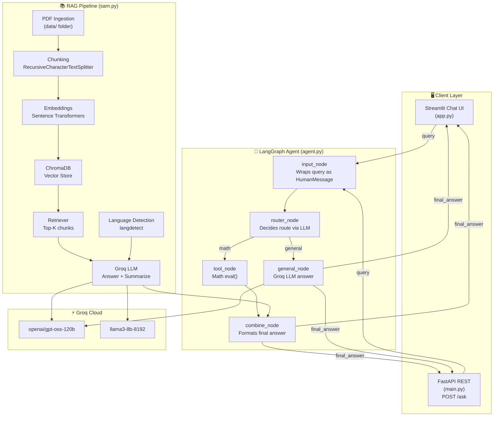
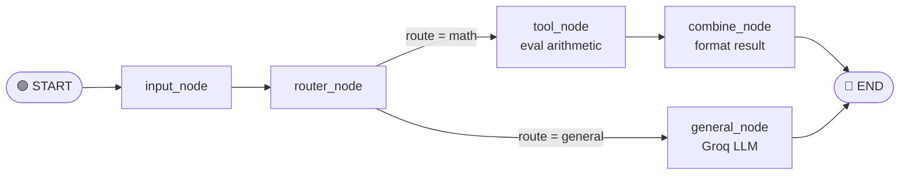
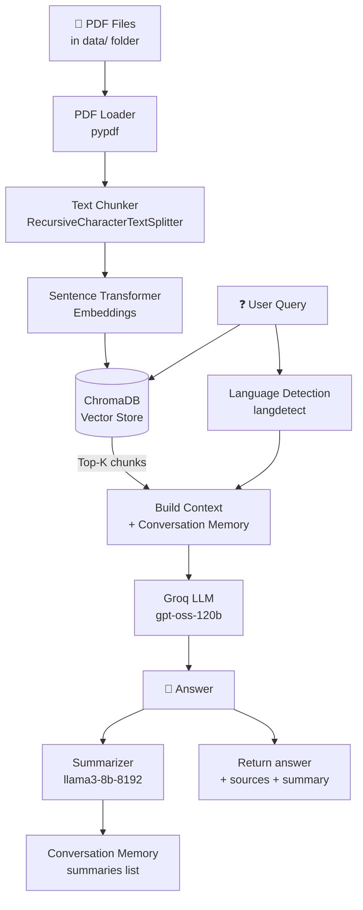
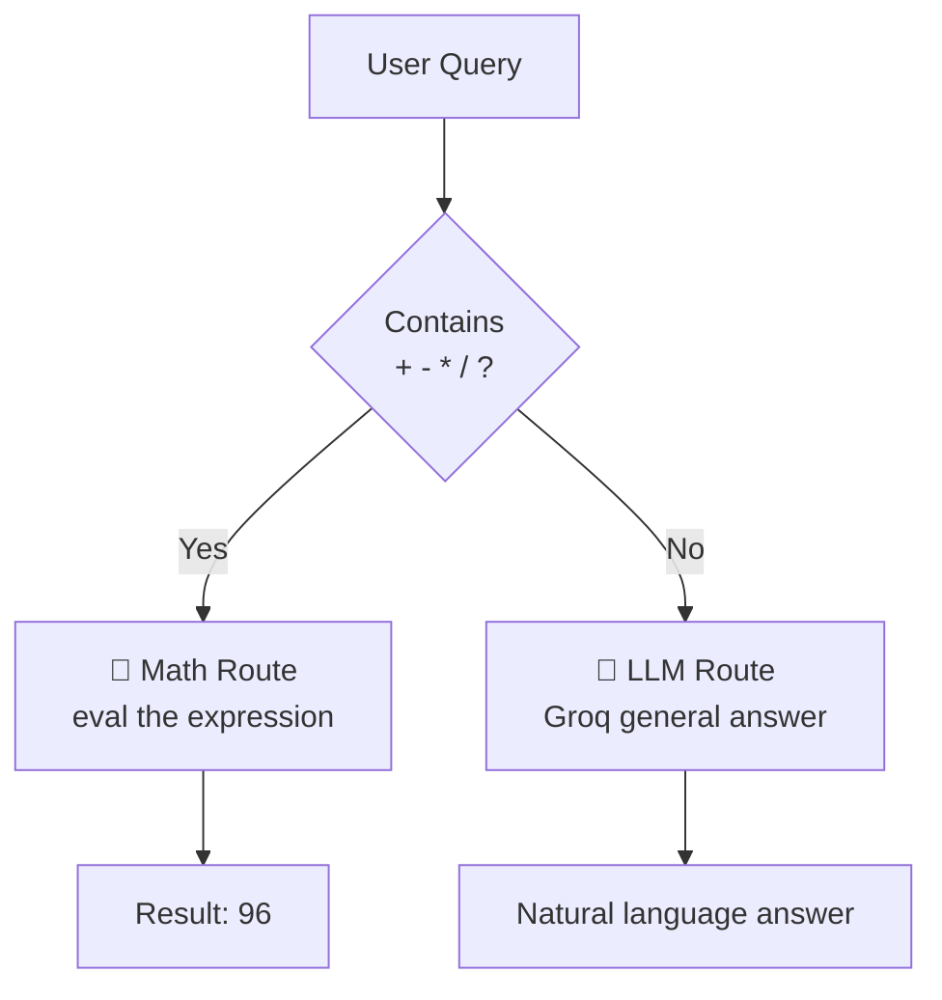

# 🤖 LangGraph Multi-Tool AI Agent

A modular AI agent built with **LangGraph**, **LangChain**, and **Groq LLM** that dynamically routes user queries to the right tool — math evaluation, general knowledge, or PDF-based RAG retrieval.

---

## System Architecture



---

## LangGraph Workflow



---

## RAG Pipeline



---

## Routing Decision Flow



---

## Features

- **Dynamic Routing** — automatically routes queries to:
  - Math tool (arithmetic evaluation)
  - General LLM (open-ended questions)
  - Vector DB / RAG (PDF document Q&A)

- **RAG Pipeline** (`sam.py`)
  - PDF ingestion and chunking via `RecursiveCharacterTextSplitter`
  - Embeddings with `sentence-transformers`
  - Retrieval via ChromaDB
  - Multi-language support (English, Hindi, Malayalam, Marathi, Urdu)
  - Conversation memory with summarization

- **Streamlit Chat UI** — ChatGPT-style interface showing route decisions and answers

- **FastAPI Backend** — REST endpoint at `/ask` for programmatic access

---

## Tech Stack

| Layer | Technology |
|---|---|
| LLM | Groq (LLaMA3 / GPT-OSS) |
| Agent Framework | LangGraph, LangChain |
| Vector DB | ChromaDB |
| Embeddings | Sentence Transformers |
| Frontend | Streamlit |
| Backend | FastAPI + Uvicorn |
| Language Detection | langdetect |

---

## Project Structure

```
├── agent.py          # LangGraph agent — routing, tool, and general nodes
├── app.py            # Streamlit chat UI
├── main.py           # FastAPI server with /ask endpoint
├── sam.py            # RAG core — Groq answers, summarization, source extraction
├── data/             # PDF documents for ingestion
├── chroma_db_1/      # Persisted ChromaDB vector store
├── requirements.txt
├── pyproject.toml
└── .env              # API keys (not committed)
```

---

## Setup

### 1. Clone the repo

```bash
git clone https://github.com/samyakdande/LangGraph-MultiState-Agent.git
cd LangGraph-MultiState-Agent
```

### 2. Install dependencies

Using `uv` (recommended):
```bash
uv sync
```

Or with pip:
```bash
pip install -r requirements.txt
```

### 3. Configure environment

Create a `.env` file:
```env
GROQ_API_KEY=your_groq_api_key_here
```

### 4. Run the Streamlit app

```bash
streamlit run app.py
```

### 5. Run the FastAPI server (optional)

```bash
uvicorn main:app --reload
```

---

## API Usage

**POST** `/ask`

```json
{
  "query": "What is 12 * 8?"
}
```

Response:
```json
{
  "answer": "Result: 96",
  "route": "math"
}
```

---

## Notes

- `chroma_db_1/` and `.env` are excluded from version control via `.gitignore`
- Place PDF files in the `data/` folder before ingestion
- The RAG pipeline in `sam.py` auto-detects the query language and responds accordingly
