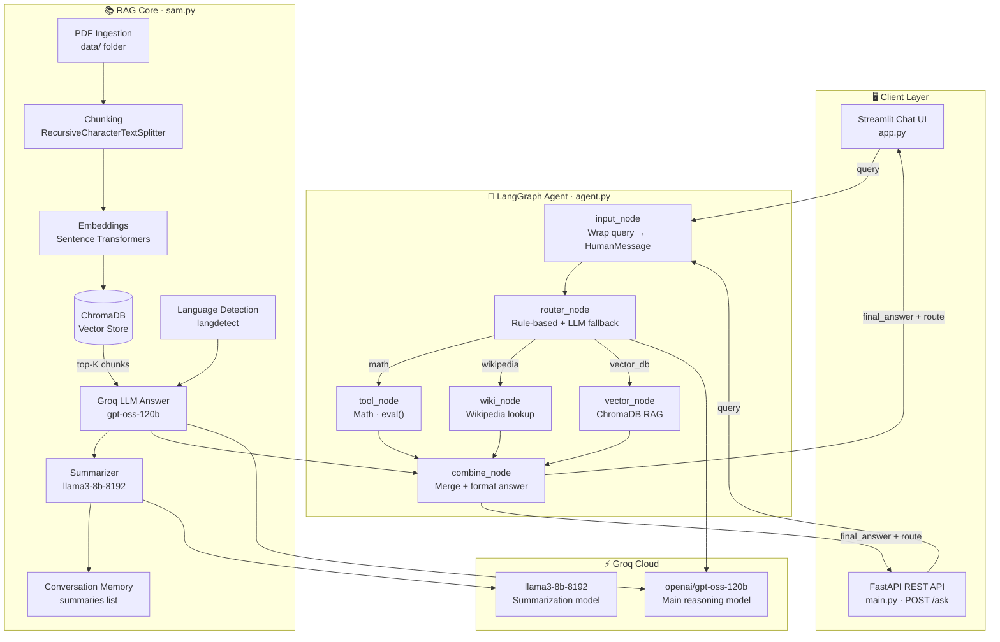
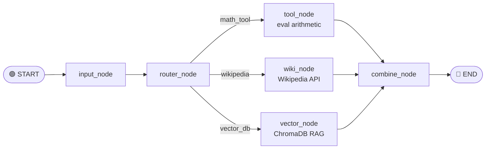
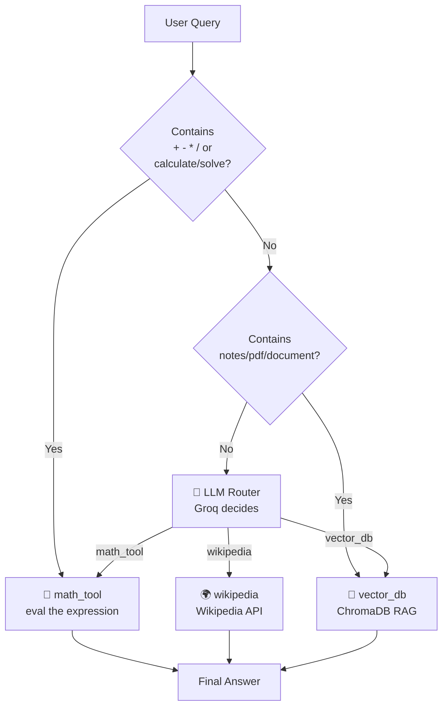
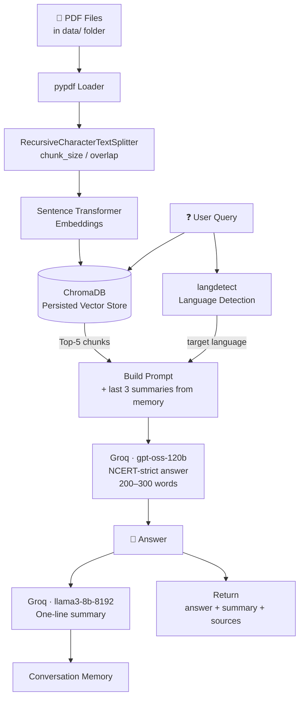
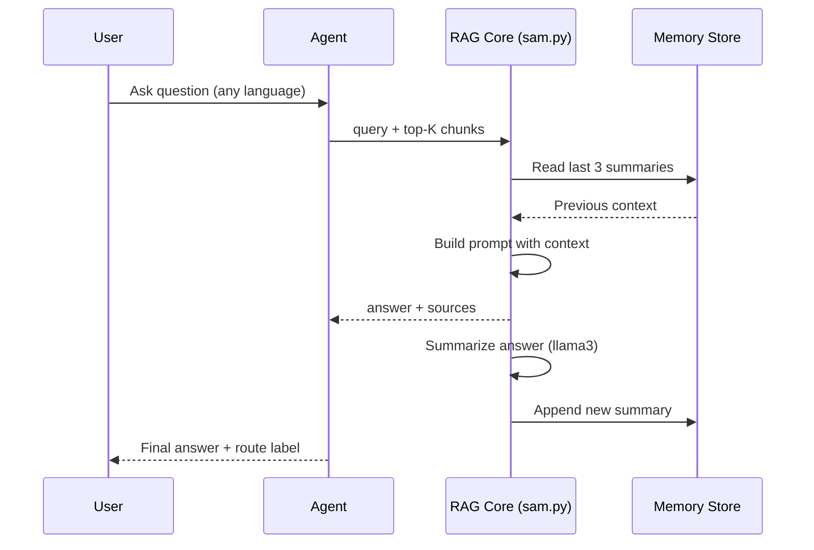
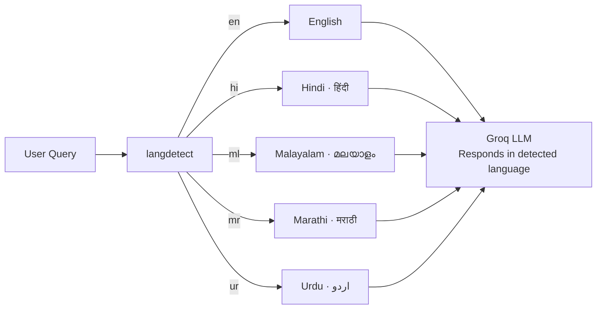

# 🤖 LangGraph Multi-Tool AI Agent

A modular AI agent built with **LangGraph**, **LangChain**, and **Groq LLM** that dynamically routes user queries to the right tool — math evaluation, Wikipedia lookup, or PDF-based RAG retrieval.

---

## System Architecture



---

## LangGraph Node Flow



---

## Routing Decision Logic



---

## RAG Pipeline



---

## Conversation Memory Flow



---

## Multi-Language Support



---

## Features

- **3-way Dynamic Routing** — math, Wikipedia, or vector DB, chosen automatically
- **Rule-based + LLM fallback router** — fast rules first, Groq decides on ambiguous queries
- **RAG Pipeline** (`sam.py`) — PDF ingestion, chunking, ChromaDB retrieval, Groq answers
- **Multi-language responses** — auto-detects query language and answers in kind
- **Conversation memory** — rolling 3-summary context window across turns
- **Streamlit Chat UI** — shows answer and route decision per query
- **FastAPI backend** — REST endpoint for programmatic access

---

## Tech Stack

| Layer | Technology |
|---|---|
| LLM | Groq (`gpt-oss-120b`, `llama3-8b-8192`) |
| Agent Framework | LangGraph, LangChain |
| Vector DB | ChromaDB |
| Embeddings | Sentence Transformers |
| Frontend | Streamlit |
| Backend | FastAPI + Uvicorn |
| Language Detection | langdetect |
| PDF Parsing | pypdf |

---

## Project Structure

```
├── agent.py          # LangGraph agent — nodes, routing, graph builder
├── app.py            # Streamlit chat UI
├── main.py           # FastAPI server — GET / and POST /ask
├── sam.py            # RAG core — Groq answers, summarization, memory
├── data/             # Drop PDF files here for ingestion
├── chroma_db_1/      # Persisted ChromaDB vector store (git-ignored)
├── local.ipynb       # Prototype notebook (3-route agent with Wikipedia)
├── requirements.txt
├── pyproject.toml
└── .env              # API keys — never committed
```

---

## Setup

### 1. Clone

```bash
git clone https://github.com/samyakdande/LangGraph-MultiState-Agent.git
cd LangGraph-MultiState-Agent
```

### 2. Install dependencies

```bash
# recommended
uv sync

# or with pip
pip install -r requirements.txt
```

### 3. Configure environment

```env
# .env
GROQ_API_KEY=your_groq_api_key_here
```

### 4. Add PDFs (optional, for RAG)

Drop any PDF files into the `data/` folder before running.

### 5. Run Streamlit UI

```bash
streamlit run app.py
```

### 6. Run FastAPI server (optional)

```bash
uvicorn main:app --reload
```

---

## API Reference

### `GET /`
Health check.
```json
{ "message": "Server running ✅" }
```

### `POST /ask`
```json
{ "query": "What is 12 * 8?" }
```
```json
{
  "answer": "Result: 96",
  "route": "math"
}
```

```json
{ "query": "Who is Albert Einstein?" }
```
```json
{
  "answer": "Albert Einstein was a German-born theoretical physicist...",
  "route": "general"
}
```

---

## Example Queries

| Query | Route | Source |
|---|---|---|
| `12 * 8 + 4` | `math_tool` | Python `eval()` |
| `Who invented the telephone?` | `wikipedia` | Wikipedia API |
| `What does my PDF say about photosynthesis?` | `vector_db` | ChromaDB RAG |
| `प्रकाश संश्लेषण क्या है?` | `vector_db` | ChromaDB RAG (Hindi) |

---

## Notes

- `chroma_db_1/` and `.env` are excluded via `.gitignore`
- The router uses rule-based matching first (fast), then falls back to Groq LLM for ambiguous queries
- RAG answers are strictly grounded in the provided PDF context — no hallucination
- Conversation memory keeps the last 3 one-line summaries for context continuity
